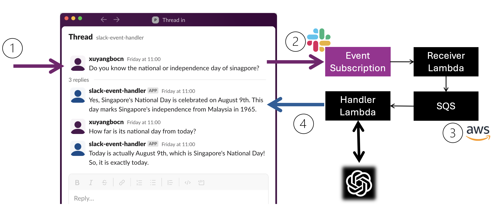

# Slack App Plus LLM

- Build a Slack App to capture and handle Slack events. [Video Part 1](https://youtu.be/O8yVftgHnVE)
- Integration with OpenAI & Azure OpenAI with support of function call, Assistant API, and Chat Completion API. [Video Part 2](https://youtu.be/lzL_F4F-tDE)

## How to Setup and Use

### 1. Create a Slack App

- Go to your Slack workspace to create an App from scratch
  - [Refer: Step1 in Slack Quick Start](https://api.slack.com/quickstart#creating)
- Go to **Your Apps >> Setting >> Basic Information >> App Credential**, note down `App ID`, `Verification Token`
- Go to **OAuth & Permissions**
  - Under **Scopes >> Bot Token Scopes**, add/remove based on what lambda event handler logic performs, E.g.
    - `app_mention:read`, `channels:history`, `groups:history`, `im:history`, `chat:write`
    - [Refer: Slack Scope List for Bot Token](https://api.slack.com/scopes?filter=granular_bot)
  - Click **Install to Workspace** and note down `Bot User OAuth Token`
- Go to **App Home >> Show Tabs >> messages tab**, toggle on and tick Allow users to send Slash commands and messages from the messages tab.

### 2. Setup infra on AWS using TF

- Configure various TF vars as needed
  - Refer to [your.auto.tfvars.sample](./your.auto.tfvars.sample)
  - [Refer: How to set TF vars using environment vars](https://developer.hashicorp.com/terraform/cli/config/environment-variables#tf_var_name)
- Run `terraform init`, `plan` and `apply`
- Note down TF output `msg_receiver_lambda_function_url`

### 3. Configure Slack App

- Go to the created Slack App >> **Event Subscriptions >> Enable Events**, toggle on & input `msg_receiver_lambda_function_url` into Request URL
- Go to **Subscribe to Bot Event >> Add Bot User Event**, add event types you would like to receive and handle. E.g.
  - `app_mention`, `message.group`, `message.channel`, `message.im`
  - [Refer: Slack Event List](https://api.slack.com/events?filter=Events)
- Go to **OAuth & Permissions**, click **Reinstall to Workspace**

### 4. Interact with Slack App

- _EITHER_ Add this Slack App to Channels you would like to monitor
- _OR_ message this Slack App directly
- (Usage also depends on this Slack App's Event Subscription and Permission setup)

## Customize Handling of Slack Events

- Refer to [sample_handler()](./lambda_msg_handler/msg_handlers/sample_handler.py) as an example
  - Create additional handler logic e.g. `xxx_handler.py`
  - Update `lambda_function.py`

## Customize LLM Function Call

- You may implement more function call in `openai_handler.py` or `az_openai_handler.py`
- Refer to [llm_tools.py](./lambda_msg_handler/msg_handlers/llm_tools.py) as an example

## Key Components

- Slack App (create on Slack)

  - To emit Slack event
  - (optional) To perform additional work as part of customizable event handling logic

- Lambda Event Recevier (Setup on AWS)

  - As destination of Slack event subscription
  - Using lambda function url as endpoint
  - Push Slack events to an SQS for further handling
  - Verify initial Slack event subscription challenge
  - Includes necessary IAM role, policy and etc

- SQS (Setup on AWS)

  - SQS to store received Slack events
  - Trigger Lambda handler for processing
  - Includes necessary IAM role, policy, kms and etc

- Lambda Event Handler (Setup on AWS)

  - Process logic to handle Slack events from SQS
    - Ex1. `sample_handler`: echo the message received
    - Ex2. `tag_user_handler`: Extract User emails in slack message, find the Slack user, and send a reply message to @user
  - Handling logic should be customized based on needs

- DynamoDB for mapping of Slack thread and OpenAI Assistant thread (Setup on AWS)

  - Store the OpenAI assistant thread id for each Slack thread
  - Only needed for OpenAI Assistant API handler

- DynamoDB to keep thread history (Setup on AWS)

  - As chat completion API requires full message history for each API call, the DDB keeps the messages in each thread
  - Only for OpenAI Chat Completion API handler

### Illustration

## Further Enhancements

- Replace deprecating Slack verification token with signning secret
- Further protection for lambda function url and alternative setup to expose lambda
- Add handler for LLM self hosted on Ollama
