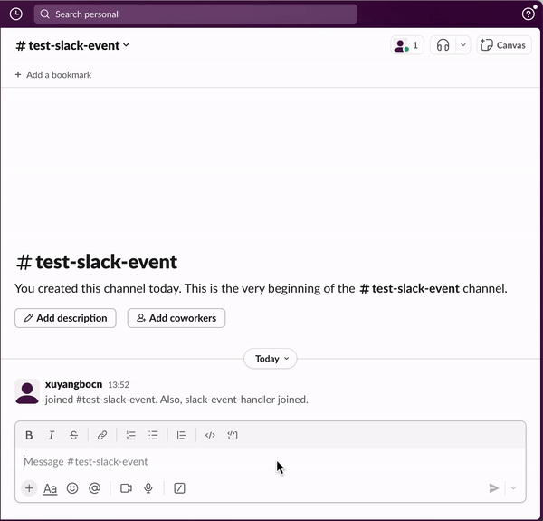

# Slack Event Handler

Integration with Slack App to capture and handle Slack events. [_(Demo on YouTube)_](https://youtu.be/O8yVftgHnVE)

## How to Setup and Use

### 1. Create a Slack App

- Go to your Slack workspace, follow Step1 in [Slack Quick Start](https://api.slack.com/quickstart#creating)
- Go to **Your Apps >> Setting >> Basic Information >> App Credential**, note down `App ID`, `Verification Token`
- Go to **OAuth & Permissions >> Scopes >> Bot Token Scopes**, add/remove based on what lambda event handler logic performs, E.g.
  - `channels:history`, `groups:history`, `im:history`: to view messages and content where this App is added in
  - `chat:write`: to post message
  - `users:read`, `users:read.email`: to search Slack users
  - [Refer: Slack Scope List for Bot Token](https://api.slack.com/scopes?filter=granular_bot)
- Go to **App Home >> Show Tabs >> messages tab**, toggle on and tick Allow users to send Slash commands and messages from the messages tab.
- Go to **OAuth & Permissions**, click **Install to Workspace**
- Note down `Bot User OAuth Token` under OAuth Tokens for Your Workspace

### 2. Setup infra on AWS using TF

- Configure TF vars for `slack_app`, e.g. `{"app_a_id" : "app_a_verification_token"}`
  - [Refer: How to set TF vars using environment vars](https://developer.hashicorp.com/terraform/cli/config/environment-variables#tf_var_name)
- Configure other TF vars as needed
- Run `terraform init`, `plan` and `apply`
- Note down TF output `msg_receiver_lambda_function_url`

### 3. Configure Slack App

- Go to the created Slack App >> **Event Subscriptions >> Enable Events**, toggle on & input `msg_receiver_lambda_function_url` into Request URL
- Go to **Subscribe to Bot Event >> Add Bot User Event**, add event types you would like to receive and handle. E.g.
  - `message.group`: to receive private channels messages
  - `message.channel`: to receive public channels messages
  - `message.im`: to receive direct message
  - [Refer: Slack event list](https://api.slack.com/events?filter=Events)
- Go to **OAuth & Permissions**, click **Reinstall to Workspace**

### 4. Interact with Slack App

- _EITHER_ Add this Slack App to Channels you would like to monitor
- _OR_ message this Slack App directly

## Customize Handling of Slack Events

- Under `lambda_msg_handler/msg_handlers/`
  - Add additional logic e.g. `xxx_handler.py`
  - Update `lambda_function.py`. Refer to `sample_handler()` as an example
  - Slack event format documentation is [here](https://api.slack.com/events/)
- Redeploy via TF to take effect

## Key Components

- Slack App (create on Slack)

  - To emit Slack event
  - (optional) To perform additional work as part of customizable event handling logic

- Lambda Event Recevier (Setup on AWS)

  - As destination of Slack event subscription
  - Using lambda function url as endpoint
  - Push Slack events to an SQS for further handling
  - Verify initial Slack event subscription challenge
  - Includes necessary IAM role, policy and etc

- SQS (Setup on AWS)

  - SQS to store received Slack events
  - Trigger Lambda handler for processing
  - Includes necessary IAM role, policy, kms and etc

- Lambda Event Handler (Setup on AWS)

  - Process logic to handle Slack events from SQS
    - Ex1. `sample_handler`: echo the message received
    - Ex2. `tag_user_handler`: Extract User emails in slack message, find the Slack user, and send a reply message to @user
  - Handling logic should be customized based on needs

### Illustration

## Further Enhancements

- Replace deprecating Slack verification token with signning secret
- Further protection for lambda function url
- Explore alternative setup to expose lambda
- Further simplify initial setup, esp. slack end.
